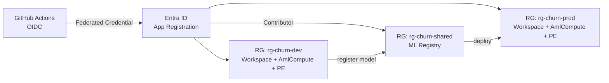

# mlops-churn-reference

> An end-to-end MLOps reference platform on **Azure ML** & **Microsoft Foundry** for **customer churn prediction**, built with **Bicep**, **MLflow**, **GitHub Actions (OIDC)**, **Fairlearn**, and **RAG**.

## Architecture

## Labs

| # | Lab | Knowledge Areas |
|---|-----|-----------------|
| 01 | labs/01-foundation/ | Workspace / Registry / Compute / Network / OIDC |
| 02 | Data & Command Job | MLTable / uri_file / uri_folder / `${{inputs.x}}` |
| 03 | MLflow Tracking ⭐ | autolog / log_param / log_metric / nested runs |
| 04 | MLflow Registry ⭐ | log_model / alias / cross-workspace promotion |
| 05 | MLflow Sweep + Pipeline ⭐ | HyperDrive / AutoML / pipeline runs |
| 06 | Deploy & Monitor | Online/Batch Endpoint / Traffic Split / Drift |
| 07 | Responsible AI | Fairlearn / RAI Dashboard / SHAP |
| 08 | Foundry RAG | Prompt flow / Groundedness / Content Safety |

## Quick Start
See labs/01-foundation/README.md.
