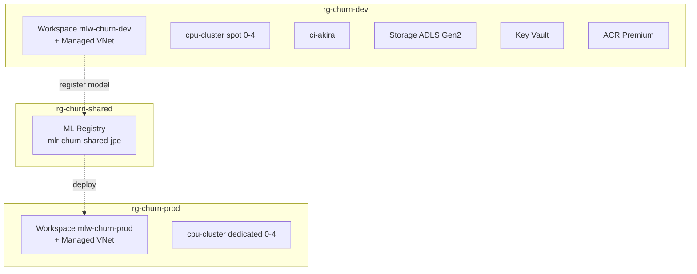

# Lab 01 — Foundation: Workspace, Registry, Compute, Network

## Knowledge Coverage

| AI-300 Topic | Where in this Lab |
|---|---|
| §1 Workspace / Asset / Registry hierarchy | `infra/main.bicep` + `infra/shared.bicep` |
| §3 Compute selection (AmlCompute spot + CI) | `modules/compute.bicep` |
| §4 Network: Managed VNet + (PE in §4 ext) | `modules/network.bicep` + workspace `managedNetwork` |
| §14 Auth: Managed Identity + SP + RBAC | Workspace SystemAssigned identity + role assignments |
| §16.1 Pipelines & Components | (groundwork; consumed in Lab 02+) |
| §16.7 KV / Managed VNet | `keyvault.bicep` + workspace `managedNetwork` |

## Architecture (recap)



## Steps

### 1. Run what-if locally
```bash
make lab-whatif ENV=dev
```

### 2. Push to GitHub
```bash
git add . && git commit -m "lab01: foundation"
git push origin main
```
GitHub Actions will:
1. `validate` (what-if)
2. `deploy-shared` → creates ML Registry
3. `deploy-dev` → dev workspace + compute
4. `deploy-prod` → **waits for your approval**, then prod workspace

### 3. Verify
```bash
uv sync
uv run pytest labs/01-foundation/verify -v --env=dev
uv run pytest labs/01-foundation/verify -v --env=prod
```

### 4. Cleanup (when done)
```bash
make lab-clean ENV=dev
make lab-clean ENV=prod
az group delete -n rg-churn-shared --yes --no-wait
```

## Knowledge Recap (復習ポイント)

- **§1 の要点**: 資産を登録 (register) → ワークスペース内で管理 (workspace) → **ワークスペース間で共有 (registry)**。このLabでは「devで学習 → Registryに登録 → prodへデプロイ」がRegistryの実践的な使い方。
- **§3 の要点**: 学習 + コスト削減 + 低運用負荷 = **AmlCompute は 0 までスケール + spot**。推論用AKSはspotを**サポートしない**。
- **§14 の要点**: Azure内部アクセス→Managed Identity（workspaceはSystemAssigned）；CI/CD→Service Principal + Federated Credential（このRepoではOIDC）。
