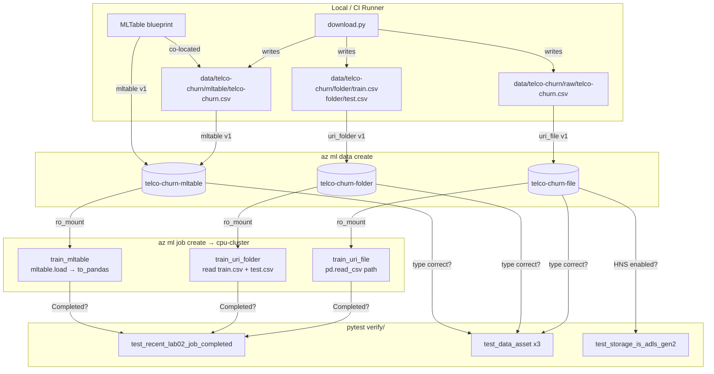

# Lab 02 — Data Assets & Command Job

## Knowledge Coverage

| AI-300 Topic | Where in this Lab |
|---|---|
| §5.1 MLTable declarative blueprint | `data/telco-churn/mltable/MLTable` |
| §5.2 `abfss://` (ADLS Gen2) vs `wasbs://` | `test_storage_is_adls_gen2` |
| §5.3 `uri_file` / `uri_folder` / `mltable` | `assets/*.yml` |
| §6 Command Job `${{inputs.x}}` | `jobs/train_*.yml` (vs `_BAD_hardcoded.yml`) |
| §16.1 Environment | `src/conda.yml` + curated image |

## Flow



## Run Locally
```bash
ENV=dev bash labs/02-data-and-job/run.sh
```

## Run via GitHub Actions
Push to main → `Lab 02 - Data & Command Job` workflow → runs against dev.

## Verify
```bash
python -m pytest labs/02-data-and-job/verify -v --env=dev
```

## Knowledge Recap

- **§5.1 口诀**：MLTable = 蓝图(blueprint)，**不存数据**；被 data asset 引用。
- **§5.2 口诀**：**a**bfss = **A**DLS Gen2 / hierarchical；wasbs = 普通 Blob / flat。末尾 **s** = TLS。
- **§5.3 口诀**：单文件 `uri_file`；多文件 `uri_folder`；带 schema/转换 `mltable`。
- **§6 口诀**：`${{inputs.x}}` 才能拿到挂载路径；硬编码本地文件名 → 失败 + 无血缘。

## What's Next
Lab 03 will use the same MLTable asset and start the **MLflow Tracking deep dive**: nested runs, autolog vs manual log, run comparison & search.
